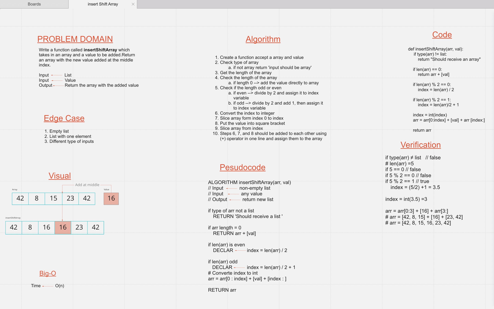

# Insert to Middle of an Array
<!-- Description of the challenge -->
  - The challenge is to write a function called **insertShiftArray** 
  - Which takes in an _array_ and a _value_ to be added. 
  - Return an array with the new value added at the **middle** index.
  - Write the function without using any of the built-in methods available to your language.  

## Whiteboard Process
<!-- Embedded whiteboard image -->

## Approach & Efficiency
<!-- What approach did you take? Discuss Why. What is the Big O space/time for this approach? -->