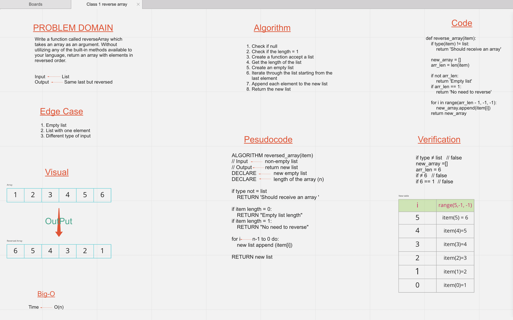

# Reverse an Array
<!-- Description of the challenge -->
  - The challenge is to write a function called **reverseArray** 
  - The function will takes an _array_ as an argument.
  - Return an array with elements in reversed order.
  - Write the function without using any of the built-in methods available to your language. 

## Whiteboard Process
<!-- Embedded whiteboard image -->

## Approach & Efficiency
<!-- What approach did you take? Discuss Why. What is the Big O space/time for this approach? -->
