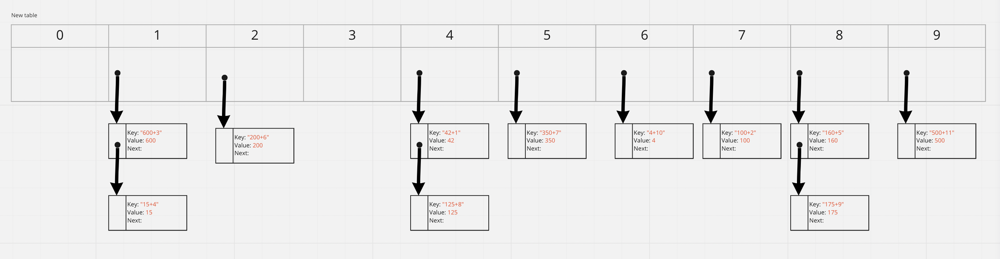

# Hashtables Lab: 30

## Summary
<!-- Short summary or background information -->
- Hashing is a technique or process of mapping keys/values into the hash table by using a hash function. It is done for faster access to elements. The efficiency of mapping depends on the efficiency of the hash function used.
- Hash tables are a data structure that utilizes key/value pairs. This means every Node or Bucket has both a key and a value.

## Challenge
<!-- Description of the challenge -->
  - ### Implement a Hashtable Class with the following methods:

    - set
      - Arguments: key, value
      - Returns: nothing
      - This method should hash the key, and set the key and value pair in the table, handling collisions as needed.
      - Should a given key already exist, replace its value from the value argument given to this method.
    - get
      - Arguments: key
      - Returns: Value associated with that key in the table
    - contains
      - Arguments: key
      - Returns: Boolean, indicating if the key exists in the table already.
    - keys
      - Returns: Collection of keys
    - hash
      - Arguments: key
      - Returns: Index in the collection for that key

## Approach & Efficiency
<!-- What approach did you take? Why? What is the Big O space/time for this approach? -->
  - **Approach**:
    - The approach here is creating a class that contain all methods.
    - Each input validated using a function.
  - **Efficiency**
    - Time complexity O(n).
    - Space complexity O(n).

## API
<!-- Description of each method publicly available in each of your hashtable -->
  - Methods
    1. Set(): Used to insert data in the hash table, the method take key and value arguments.
    2. Get(): Used to retrieve a value depending on the passed key.
    3. Contains(): Check if a a key exist or not and return a boolean.
    4. Keys(): Used to retrieve all available keys in the hash table.

---

# Hashtable lab:31

## Challenge Summary
<!-- Description of the challenge -->
  - Write a function called repeated word that finds the first word to occur more than once in a string
      - Arguments: string
      - Return: string

## Whiteboard Process
<!-- Embedded whiteboard image -->

## Approach & Efficiency
<!-- What approach did you take? Why? What is the Big O space/time for this approach? -->
  - The approach is use the hashmap to make the repeated word have a specific index.
  - So, every repeated word will be have the same index.
  - Big(O)
    - Time O(n2)
    - Space O(n)

## Solution
<!-- Show how to run your code, and examples of it in action -->
- ### To check my solution:
    - Go to the directory `hash-table/hash_table`
    - and type `python hashmap_repeated_word.py`

---
# Hashtable lab:32

## Challenge Summary
<!-- Description of the challenge -->
  - Write a function called **tree_intersection** that takes two binary trees as parameters.
  - Using your Hashmap implementation as a part of your algorithm, return a set of values found in both trees.

## Whiteboard Process
<!-- Embedded whiteboard image -->

## Approach & Efficiency
<!-- What approach did you take? Why? What is the Big O space/time for this approach? -->
- Approach 
  - Create a hash table 
  - loop through the first tree and hash it with a key that equal to value and location
  - loop through the second tree and create a key with the value and location
- Complexity
  - Time --> O(n2)
  - Space --> O(n)

## Solution
<!-- Show how to run your code, and examples of it in action -->
- Go to the directory `hash-table/hash_table`
- and type `python tree_intersection.py`
