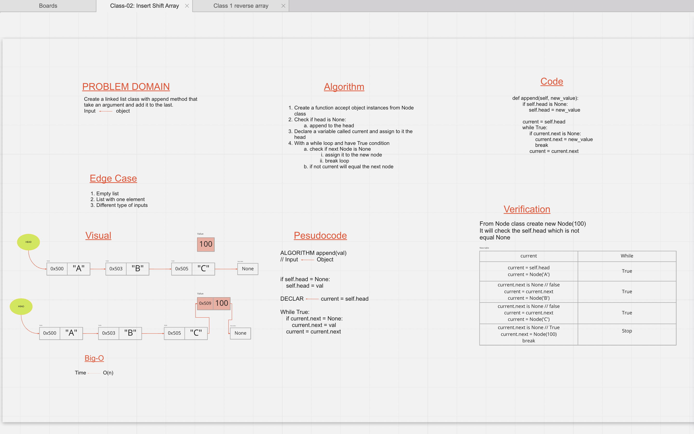
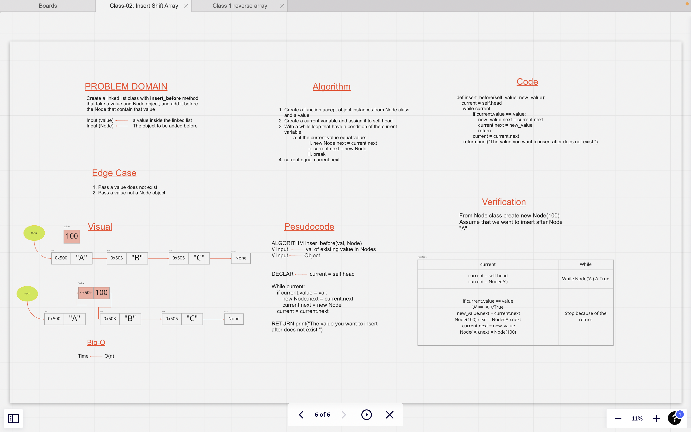
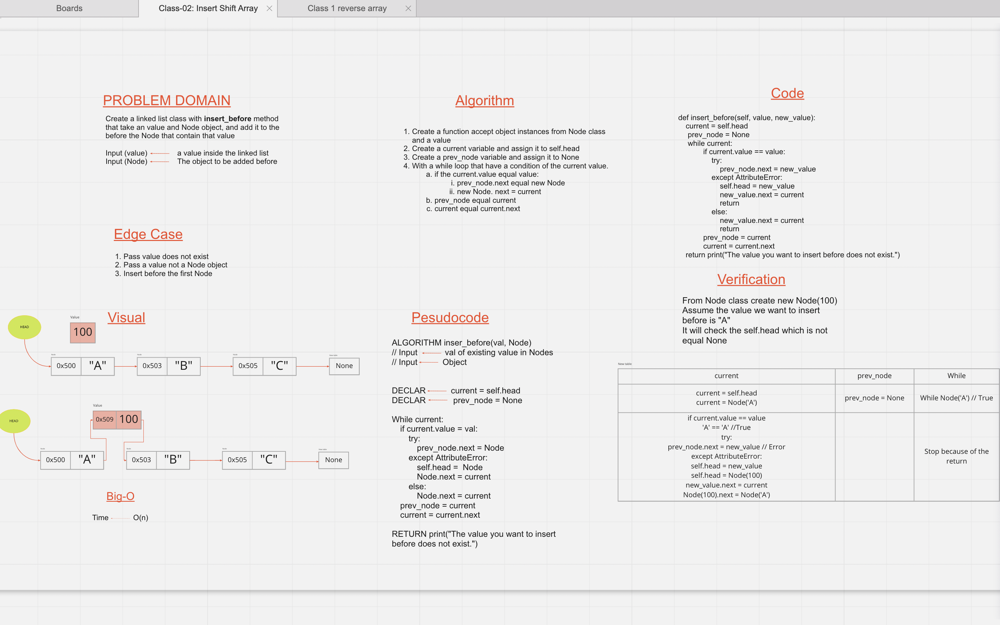
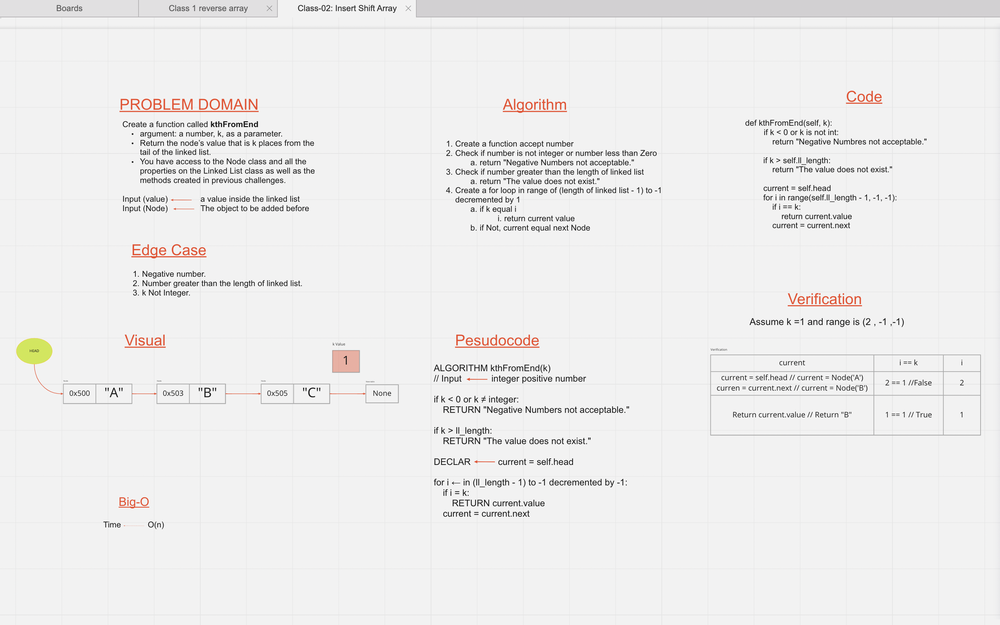

# Lab 05
# Singly Linked List (SLL)
<!-- Short summary or background information -->
  - SLL is a linear data structure.
  - SLL is faster for insertion and deletion at the beginning (Big-O(1)).
  - SLL use the space when it is needed, in opposite of array.

## Challenge
<!-- Description of the challenge -->
  - **Lab class 05**
      - Implementing **Node** class.
      - Implementing **Linked List** class.
      - Create insert method, to insert at the beginning.
      - Create include method to search for a value.
      - Create a method for printing elements.

## Approach & Efficiency
<!-- What approach did you take? Why? What is the Big O space/time for this approach? -->

## API
<!-- Description of each method publicly available to your Linked List -->

---

# Lab 06

## Challenge Summary
<!-- Description of the challenge -->
  - Create the append method, which add a new node to the end of the linked list.
  - Create the insert_after method, which take two argument a value and Node, and add the new node after the the node that have the value passed
  - Create the insert_before, which take two argument a value and a Node, and add the new node before the node that have that value.
  - Create a delete method, which take a value, and delete the node that have the value. 

### Whiteboard Process
<!-- Embedded whiteboard image -->

### Approach & Efficiency
<!-- What approach did you take? Why? What is the Big O space/time for this approach? -->

### Solution
<!-- Show how to run your code, and examples of it in action -->
   - Go to the directory `linked_lists`
   - and type `python linked_list.py`

---

# Lab 07

# Challenge Summary
<!-- Description of the challenge -->
  - Create a method that take a number represent the position of a node.
    - if the position exist return the value of that node
    - if not, return does not exist

## Whiteboard Process
<!-- Embedded whiteboard image -->

## Approach & Efficiency
<!-- What approach did you take? Why? What is the Big O space/time for this approach? -->
  - Big-O(n)

## Solution
<!-- Show how to run your code, and examples of it in action -->
  - Create a variable in the linked list class to represent the length of the linked list.
  - By tracking all the inserted nodes, by increasing the variable length.
  ### To check my solution:
    - Go to the directory `linked_lists`
    - and type `python linked_list.py`