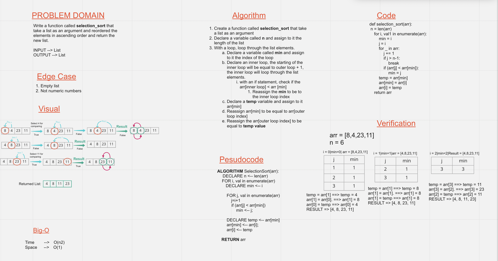

# Challenge Summary
  - Implementing selection sort
  - Write unit test for the algorithm
  - Create a whiteboard for the algorithm

## Whiteboard Process

## Approach & Efficiency
<!-- What approach did you take? Why? What is the Big O space/time for this approach? -->
  - The approach is create a variable called **min** with initial value of 0.
  - Then holds the first element and compare it with the list of the array to check if there is a lowest number than it:
    - if yes -> the **min** variable will be equal to the index of the new element and compare it with the rest of the elements.
    - if no -> the **min** variable will be equal to the index of the first element
  - Then replace the value of the indics

## Solution
  - Go to the directory `selection-insertion/selection_insertion`
  - and type `python selection_insertion.py`
