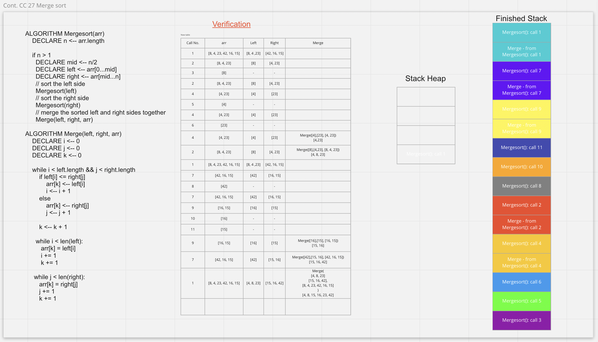

# Code challenge 26: Insertion Sort
## Challenge Summary
  - Implementing selection sort
  - Write unit test for the algorithm
  - Create a whiteboard for the algorithm

### Whiteboard Process

### Approach & Efficiency
<!-- What approach did you take? Why? What is the Big O space/time for this approach? -->
  - The approach is create a variable called **min** with initial value of 0.
  - Then holds the first element and compare it with the list of the array to check if there is a lowest number than it:
    - if yes -> the **min** variable will be equal to the index of the new element and compare it with the rest of the elements.
    - if no -> the **min** variable will be equal to the index of the first element
  - Then replace the value of the indics

### Solution
  - Go to the directory `selection-insertion/selection_insertion`
  - and type `python selection_insertion.py`

--- 

# Code challenge 27: Merge Sort
## Challenge Summary
  - Implementing merge sort
  - Write unit test for the algorithm
  - Create a whiteboard for the algorithm

### Whiteboard Process

### Approach & Efficiency
<!-- What approach did you take? Why? What is the Big O space/time for this approach? -->
  - Merge Sort is a Divide and Conquer algorithm. It divides the input array into two halves, calls itself for the two halves, and then it merges the two sorted halves.
  - The **merge()** function is used for merging two halves. The merge(left, right, arr) is a key process that assumes that `arr[0 : middle]` and `arr[middle+1 : n-1]` are sorted and merges the two sorted sub-arrays into one.
  - Time and space complexity for merge sort is:
    - Time: O(n log(n))
    - Space: O(n)

### Solution
  - Go to the directory `sorting-methods/merge_sort`
  - and type `python merge_sort.py`
