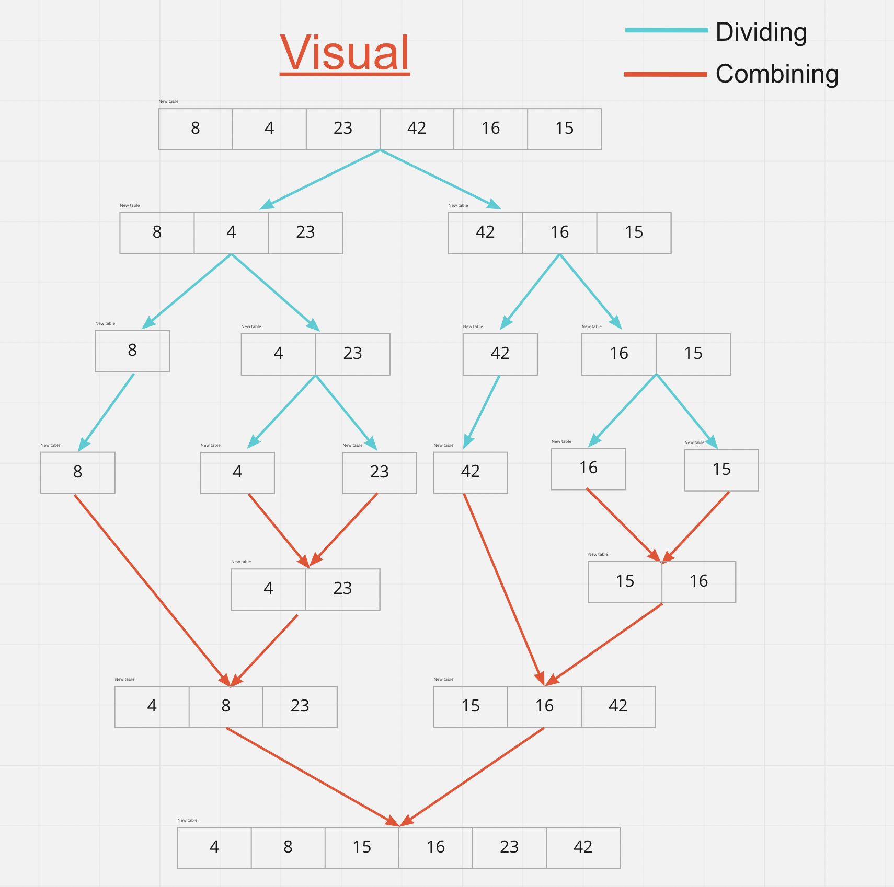
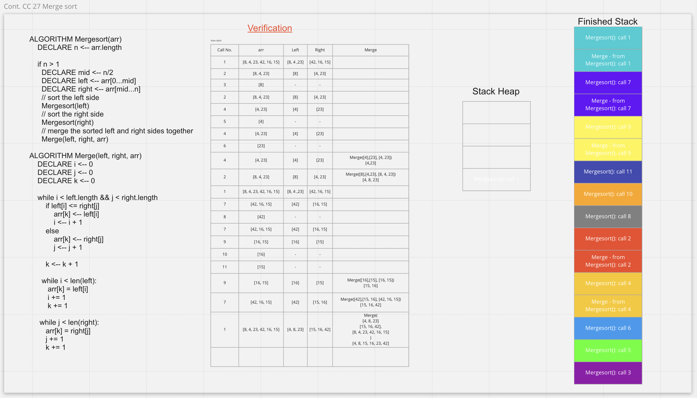

# What is Merge Sort?
  - **Merge sort** is an algorithm for rearranging an array.
   - The algorithm divides the array into two halves, recursively sorts them, and finally merges the two sorted halves.

# How does merge sort work?
  - **Merge sort** used the DAC technique.
  - DAC stands for ***Divide and Conquer***.
    - Which means dividing the problem into halves, which will give us sub-problems.
    - Then solves the sub-problems recursively unit it solved.
    - Finally, combine the sub-problems to get the final solution for the whole problem.
  - Check the image below to understand the process.




# Here is the pseudocode 

```
ALGORITHM Mergesort(arr)
    DECLARE n <-- arr.length

    if n > 1
      DECLARE mid <-- n/2
      DECLARE left <-- arr[0...mid]
      DECLARE right <-- arr[mid...n]
      // sort the left side
      Mergesort(left)
      // sort the right side
      Mergesort(right)
      // merge the sorted left and right sides together
      Merge(left, right, arr)

ALGORITHM Merge(left, right, arr)
    DECLARE i <-- 0
    DECLARE j <-- 0
    DECLARE k <-- 0

    while i < left.length && j < right.length
        if left[i] <= right[j]
            arr[k] <-- left[i]
            i <-- i + 1
        else
            arr[k] <-- right[j]
            j <-- j + 1

        k <-- k + 1

    if i = left.length
       set remaining entries in arr to remaining values in the right
    else
       set remaining entries in arr to remaining values in left
``` 

# Check the image for algorithm trace:
  - Assume arr = [8, 4, 23, 42, 16, 15]  


## Code implementation
```python
def merge_sort(arr):
    n = len(arr)

    if n > 1:
        mid = n//2
        left = arr[:mid]
        right = arr[mid:]
        # sort the left side
        merge_sort(left)
        #  sort the right side
        merge_sort(right)
        #  merge the sorted left and right sides together
        merge(left, right, arr)


def merge(left, right, arr):
    i = 0
    j = 0
    k = 0

    while i < len(left) and j < len(right):
        if left[i] <= right[j]:
            arr[k] = left[i]
            i = i + 1
        else:
            arr[k] = right[j]
            j = j + 1

        k = k + 1

    while i < len(left):
        arr[k] = left[i]
        i += 1
        k += 1

    while j < len(right):
        arr[k] = right[j]
        j += 1
        k += 1
```


# Time and space complexity
  - Time complexity of Merge Sort is O(n Log(n))
  - Space complexity O(n)

# Merge Sort applications
  1. Merge Sort is useful for sorting linked lists in O(n Logn) time.
  2. Inversion Count Problem
  3. Used in External Sorting

---
### Resource
  - [geeksforgeeks](https://www.geeksforgeeks.org/merge-sort/)
  - [Hash node blog](https://explanations.hashnode.dev/merge-sort#heading-what-is-merge-sort)
