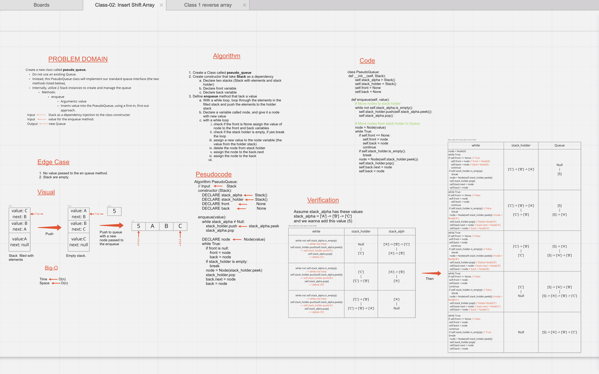
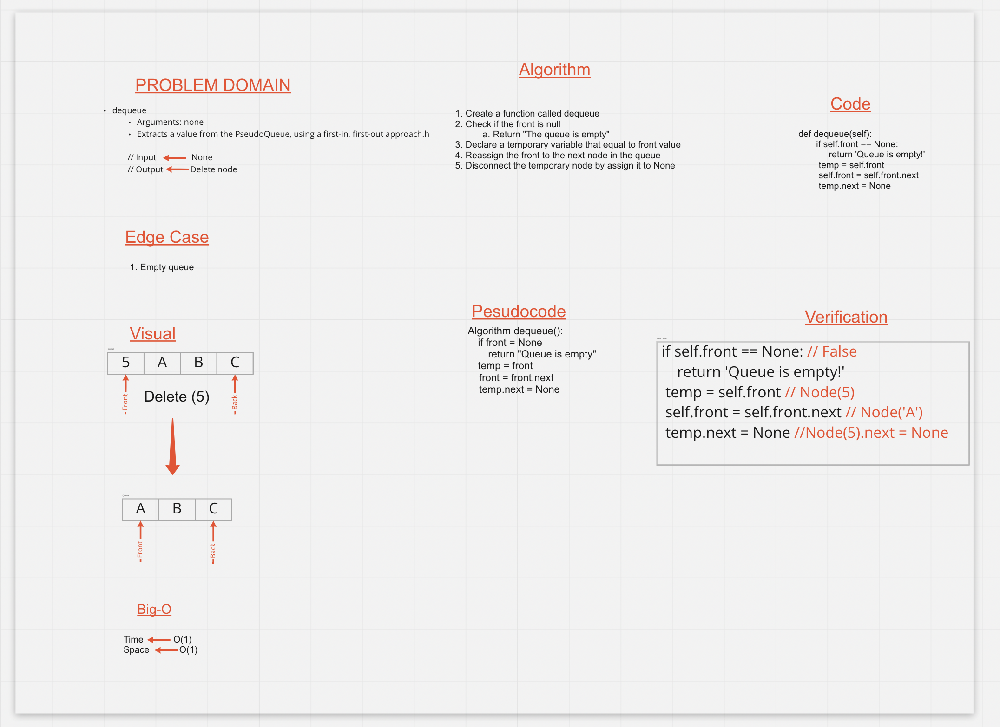

# **CC 10**: Stacks and Queues
<!-- Short summary or background information -->
  - **Stack**: it is a linear data structure, it consist of nodes, each node pointing to the previous node, and it have an indicator called _top_, the _top_ points to the last node in stack.
  - **Queue**:  it is a linear data structure, it consist of nodes,each node linked to the next node, the queue have two indicators the first one called _front_, the _front_ points to the first node in queue, the second one called _back_ or _rear_, the _back_ points to the last node in queue.

## Challenge
<!-- Description of the challenge -->
 - Implement Stack and Queue class.
 - Implement Stack and Queue methods.
   - Add
   - Delete
   - Peek
   - Is_Empty
 - Test each method

## Approach & Efficiency
<!-- What approach did you take? Why? What is the Big O space/time for this approach? -->
  - Efficiency
    - Big-O(1) for space and time complexity.

## API
<!-- Description of each method publicly available to your Stack and Queue-->
  - Stack Methods:
    - **Push**: Add a new node to the stack.
    - **Pop**: Delete last node in stack.
    - **Peek**: Return the value that the top indicates.
    - **is_empty**: Check if the stack empty and return boolean value.
  - Queue Methods:
    - **Enqueue**: Add a new node the the queue.
    - **Dequeue**: Delete the first node from the queue.
    - **Peek**: Return the value of the front node.
    - **is_empty**: Check if the stack empty and return boolean value.

---

# **CC 11**: Pseudo Queue.

## Challenge Summary
<!-- Description of the challenge -->
  - Implement PseudoQueue class.
  - Implement enqueue method that take a value and add new nodes to the queue.
    -  Use stack class to add the items to the queue.
    -  e.g. `[10]->[15]->[20]` -> `[new node]->[10]->[15]->[20]`
 -  Implement dequeue method to delete a node from queue.

## Whiteboard Process
<!-- Embedded whiteboard image -->

## Approach & Efficiency
 - Create a class PseudoQueue with two methods enqueue and dequeue.
   - **Enqueue**: Take a value and looping through a stack to move nodes to another stack to reverse order of the stack. Then with another loop to loop through the second stack, add the new node to queue and then add the elements from the second stack to queue. this method take a Big-O(n) for time and space.
   - **Dequeue**: Take no value and delete first node every time from the queue. This method take a Big-O(1) for time an space.

## Solution
<!-- Show how to run your code, and examples of it in action -->
  - Go to the directory `stack_and_queue` from you terminal.
  - Type `Python` and the file name `stack_and_queue.py` to run the file.
