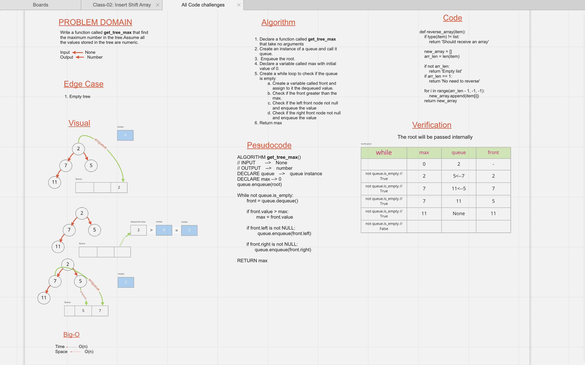
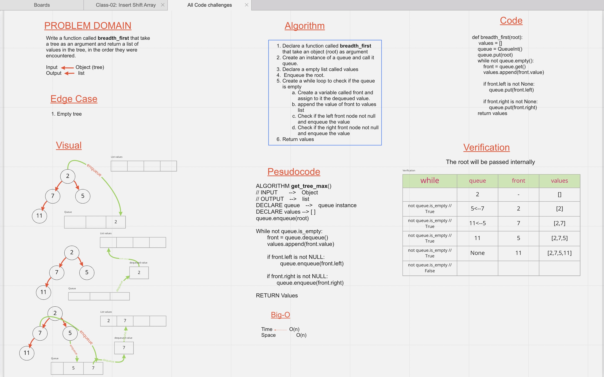

# Code challenge 15

## Trees
<!-- Short summary or background information -->
  - Tree is a non-linear data structure.
  - Tree consist of nodes.
  - Each node can be a root for it's children.
  - If the root node has two nodes it called **Binary Tree**, and the two nodes can be left and right nodes.
  - If the node have more than two nodes the tree called **K-ary Trees**.
  - ## The tree terminology are:
    1. **Node**: A Tree node is a component which may contain its own values, and references to other nodes
    2. **Root**: The root is the node at the beginning of the tree
    3. **K - A**: number that specifies the maximum number of children any node may have in a k-ary tree. In a binary tree, k = 2.
    4. **Left**: A reference to one child node, in a binary tree
    5. **Right**: A reference to the other child node, in a binary tree
    6. **Edge**: The edge in a tree is the link between a parent and child node
    7. **Leaf**: A leaf is a node that does not have any children
    8. **Height**: The height of a tree is the number of edges from the root to the furthest leaf.  

## Challenge
<!-- Description of the challenge -->
  - Implement **TreeNode** class.
  - Implement **Binary Tree** class with a three methods:
    - Pre order
    - In order
    - Post order
  - Implement **Binary Search Tree** with the following methods:
    - Add
    - Contains

## Approach & Efficiency
<!-- What approach did you take? Why? What is the Big O space/time for this approach? -->
  - Creating a class for each task **Tree Node**, **Binary Search Tree**, **Binary Tree** using OOP approach.
    - The **TreeNode** create a node object, with a Big-O(1) for time and space.
    - The **BinarySearchTree** class have three methods:
      - **Add** method to add a new node from left to right with a Big-O(n) for time and Big-O(n) for space.
      - **breadth_first** method print the nodes values with a Big-O(n) for time and Big-O(n) for space.
      - **contains** method check if a value in a tree or not with a Big-O(n) for time and Big-O(n) for space.
    - The **Binary Tree** class have three methods:
      - **Pre order** method print the values using this approach `root >> left >> right` Big-O(n^2) for time and Big-O(n)
      - **In order** method print the values using this approach `left >> root >> right` Big-O(n^2) for time and Big-O(n)
      - **Post order** method print the values using this approach `left >> right >> root` Big-O(n^2) for time and Big-O(n)
## API
<!-- Description of each method publicly available in each of your trees -->
  - The **BinarySearchTree** class have three methods:
    - **Add** method take a value as an argument and add it to the tree and return an array for where the new value added.
    - **breadth_first** method take no argument and return an array of the values in the tree.
    - **contains** method take a value as an argument and check if the value in a tree or not and return True or False.
  - The **Binary Tree** class have three methods:
     - **Pre order** method take no argument, and return an array contain the values of the tree in the following order `root >> left >> right`
      - **In order** method take no argument, and return an array contain the values of the tree in the following order `left >> root >> right`
      - **Post order** method take no argument, and return an array contain the values of the tree in the following order `left >> right >> root`

---

# Code challenge 16

# Challenge Summary
<!-- Description of the challenge -->
  - Write a function called get_tree_max that find the maximum number in the tree.Assume all the values stored in the tree are numeric.
  - The function take no argument and return a number.

## Whiteboard Process
<!-- Embedded whiteboard image -->

## Approach & Efficiency
<!-- What approach did you take? Why? What is the Big O space/time for this approach? -->
  - I used the approach of breadth first, because the tree node are not in ascending order.
  - The complexity for time and space are O(n).

## Solution
<!-- Show how to run your code, and examples of it in action -->
  - ### To check my solution:
    - Go to the directory `trees/trees`
    - and type `python binary_tree.py`

---
# Code challenge 17

# Challenge Summary
<!-- Description of the challenge -->
  - Write a function called **breadth_first** that take a tree object as an argument and return a list of values in the tree, in the order they were encountered.

## Whiteboard Process
<!-- Embedded whiteboard image -->

## Approach & Efficiency
<!-- What approach did you take? Why? What is the Big O space/time for this approach? -->
  - The approach is looping through the tree values level by level and append the values to a list.
  - Big-O(n) for time and space.

## Solution
<!-- Show how to run your code, and examples of it in action -->
   - Go to the directory `trees/trees`
   - and type `python breadth_first.py`
